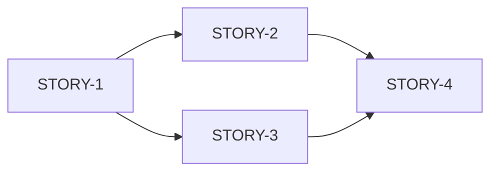

# /plan — Scale-Adaptive Planning

Автоматически определяет сложность задачи и предлагает соответствующий воркфлоу.

## Scale-Adaptive Levels

| Level | Тип задачи | Effort | Воркфлоу |
|-------|-----------|--------|----------|
| **0** | Bug fix | < 2h | → сразу код → `/code-review` |
| **1** | Small feature | 2h-1d | → `/quick-spec` → `/dev-story` |
| **2** | Medium feature | 1d-3d | → `/plan` (full) → stories → `/dev-story` |
| **3** | Epic | 1w-2w | → `/plan` + `@architect` review |
| **4** | Platform change | > 2w | → PRD → Architecture → Epics |

## Входные данные

```
/plan

[Описание задачи]
```

Опционально:
- GAP ID из `docs/audit/GAP_ANALYSIS_REPORT.md`
- Явное указание Level

## Процесс

### Step 1: Определение Level

**Автоматические критерии:**

| Критерий | Level |
|----------|-------|
| 1-2 файла, понятный fix | 0 |
| Одна страница/endpoint | 1 |
| Несколько связанных изменений | 2 |
| Новый модуль/подсистема | 3 |
| Архитектурные изменения | 4 |

**GAP Priority Mapping:**

| GAP Priority | Suggested Level |
|--------------|-----------------|
| LOW, Effort < 4h | 0-1 |
| MEDIUM | 1-2 |
| HIGH, Effort > 1d | 2-3 |
| Multiple HIGH GAPs | 3-4 |

### Step 2: Воркфлоу по Level

#### Level 0: Bug Fix
```
Определён Level 0 (Bug Fix)

Рекомендация: Приступай к исправлению напрямую.

После исправления:
/code-review
```

#### Level 1: Small Feature
```
Определён Level 1 (Small Feature)

Рекомендация:
/quick-spec [описание]

Это сгенерирует tech-spec со stories.
```

#### Level 2: Medium Feature
```
Определён Level 2 (Medium Feature)

Создаю полный план...
[full planning output below]
```

#### Level 3-4: Epic / Platform
```
Определён Level [3|4] (Epic / Platform Change)

Рекомендация: Требуется архитектурный анализ.

1. @agent architect — для архитектурных решений
2. /plan — после утверждения архитектуры

Или переключись в Plan Mode для детальной проработки.
```

### Step 3: Full Planning (Level 2+)

1. **Проанализируй существующий код**
2. **Проверь связанные гэпы** в `docs/audit/GAP_ANALYSIS_REPORT.md`
3. **Определи scope** (web, api, both)
4. **Разбей на stories** (atomic, 1-4h each)
5. **Укажи dependencies** между stories
6. **Оцени risks**

## Output Format

### Level 0-1 Output

```markdown
## Quick Assessment: [Name]

**Level**: 0 (Bug Fix) | 1 (Small Feature)
**Effort**: [estimate]
**GAP**: [ID if applicable]

### Recommendation

[Конкретное действие]

### Next Step

`/quick-spec [описание]` или сразу в код
```

### Level 2+ Output

```markdown
## Implementation Plan: [Name]

**Level**: [2 | 3 | 4]
**Effort**: [total estimate]
**Scope**: [web | api | both]
**GAP**: [ID if applicable]

---

### Overview

[High-level описание]

### Architecture Impact

- [ ] Database changes: [yes/no, details]
- [ ] API changes: [yes/no, details]
- [ ] UI changes: [yes/no, details]
- [ ] Breaking changes: [yes/no, details]

---

### Stories

#### STORY-1: [Title]
**Effort**: [Xh]
**Scope**: [web | api]
**Dependencies**: none

- [ ] [subtask 1]
- [ ] [subtask 2]

**Acceptance Criteria**:
- [ ] [criterion]

---

#### STORY-2: [Title]
**Effort**: [Xh]
**Dependencies**: STORY-1

...

---

### Implementation Order



1. STORY-1 — [reason]
2. STORY-2, STORY-3 — [parallel possible]
3. STORY-4 — [after S2, S3]

---

### Files to Modify

| File | Story | Action |
|------|-------|--------|
| `path/to/file.ts` | STORY-1 | [modify/create] |

---

### Risks

| Risk | Impact | Mitigation |
|------|--------|------------|
| [risk] | [H/M/L] | [strategy] |

---

### Dependencies

**External:**
- [third-party services, APIs]

**Internal:**
- [other modules, features]

**Blocking GAPs:**
- [GAPs that must be closed first]

---

### Acceptance Criteria

- [ ] [criterion 1]
- [ ] [criterion 2]

---

### Estimated Total

| Metric | Value |
|--------|-------|
| Stories | [N] |
| Total Effort | [Xd] |
| Files | [N] |

---

### Next Steps

1. Review plan
2. `/dev-story STORY-1`
3. Repeat for each story
4. `/code-review` after each story
```

## GAP Integration

При указании GAP ID:

1. **Найди гэп** в `docs/audit/GAP_ANALYSIS_REPORT.md`
2. **Проверь связи** в CJM аудитах
3. **Оцени Impact/Effort** для Level определения
4. **Включи в план** связанные гэпы

```
/plan

GAP P1: Нет страницы профиля `/profile`
```

## Примеры

### Level 0 Example

```
/plan

Фикс: кнопка "Назад" в /cases/[id] использует router.back()
```

Output:
```
## Quick Assessment: Fix back navigation in cases

**Level**: 0 (Bug Fix)
**Effort**: 1h
**GAP**: M4

### Recommendation

Простой fix — замена `router.back()` на `router.push('/cases')`.

### Next Step

Приступай к исправлению, затем `/code-review`.
```

### Level 2 Example

```
/plan

GAP P1: Реализовать страницу профиля `/profile`
- Отображение данных
- Смена пароля
- Настройки
```

Output: полный план с 4-5 stories.

## Связь с другими командами

| Если... | То... |
|---------|-------|
| Level 0 | → сразу код → `/code-review` |
| Level 1 | → `/quick-spec` |
| Level 2 | → plan → `/dev-story` per story |
| Level 3+ | → `@agent architect` first |
| Sprint planning | → `/sprint-init` after planning |
