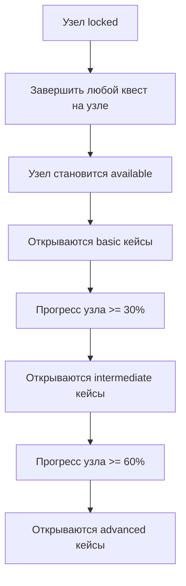

# Система развития пользователя

**Версия:** 1.0  
**Дата:** 09.01.2026  
**Статус:** Актуальная

---

## Оглавление

1. [Введение](#введение)
2. [Архитектура системы](#архитектура-системы)
3. [Путь развития пользователя](#путь-развития-пользователя)
4. [Связь квестов и кейсов](#связь-квестов-и-кейсов)
5. [Экран прогресса развития](#экран-прогресса-развития)
6. [API и данные](#api-и-данные)
7. [UI компоненты](#ui-компоненты)
8. [Связанные документы](#связанные-документы)

---

## Введение

### Назначение

Система развития пользователя объединяет квесты и кейсы в единый путь обучения:

- **Квесты** — практика в реальности, применение навыков в жизни
- **Кейсы** — закрепление теории, анализ ситуаций в безопасной среде

### Ключевой принцип

> **Квесты открывают кейсы:** Для доступа к кейсам на узле нужно выполнить хотя бы один квест на этом узле.

Это создает последовательный путь развития:

```
Узел locked → Выполнить квест → Узел available → Кейсы доступны
```

---

## Архитектура системы

### Целевая архитектура



### Компоненты системы

| Компонент | Описание | Файлы |
|-----------|----------|-------|
| Страница развития | Экран `/development` с прогрессом | `apps/web/src/app/development/page.tsx` |
| Хук useDevelopment | Агрегация данных о прогрессе | `apps/web/src/hooks/useDevelopment.ts` |
| API квестов | Endpoint для завершенных квестов | `apps/api/src/quests/quests.controller.ts` |
| API кейсов | Endpoint для доступности кейсов | `apps/api/src/cases/cases.controller.ts` |
| CaseLockedModal | Модальное окно с ссылкой на квесты | `apps/web/src/components/CaseLockedModal.tsx` |

---

## Путь развития пользователя

### Этапы развития

1. **Начало** — Пользователь видит заблокированные узлы, доступные квесты
2. **Квест** — Выполняет квест в реальности, получает XP
3. **Разблокировка** — Узел переходит в available, открываются basic кейсы
4. **Практика** — Решает кейсы, углубляет понимание
5. **Прогресс** — Достигает порогов 30%/60%, открываются сложные кейсы
6. **Мастерство** — Узел становится integrated при 100% прогрессе

### Формула прогресса

```typescript
// Общий прогресс узла (0-100%)
const questProgress = questsCompleted / questsTotal * 100;
const caseProgress = casesCompleted / casesTotal * 100;
const overallProgress = questProgress * 0.6 + caseProgress * 0.4;
```

**Веса:**
- 60% — прогресс по квестам (практика в реальности важнее)
- 40% — прогресс по кейсам (теоретическое закрепление)

### Статусы развития узла

| Статус | Условия | Визуализация |
|--------|---------|--------------|
| `locked` | Узел заблокирован | Серый, opacity 60% |
| `in_progress` | Есть прогресс < 80% | Синий, активный |
| `mastered` | Прогресс >= 80% | Зеленый, завершенный |

---

## Связь квестов и кейсов

### Правила доступности кейсов

| Условие | basic | intermediate | advanced |
|---------|-------|--------------|----------|
| Квестов = 0 | ❌ | ❌ | ❌ |
| Квестов >= 1, прогресс < 30% | ✅ | ❌ | ❌ |
| Квестов >= 1, прогресс >= 30% | ✅ | ✅ | ❌ |
| Квестов >= 1, прогресс >= 60% | ✅ | ✅ | ✅ |

### Логика проверки

```typescript
// Функция проверки доступности кейса
function isCaseAvailable(case_: InteractiveCase): boolean {
  // 1. Проверить состояние узла
  if (node.state === 'locked') return false;
  
  // 2. КЛЮЧЕВОЕ: Проверить наличие завершенных квестов
  const completedQuestsOnNode = quests.filter(
    q => q.status === 'done' && q.linked_nodes?.includes(case_.node_id)
  ).length;
  
  if (completedQuestsOnNode === 0) {
    return false; // Нет квестов — нет доступа к кейсам
  }
  
  // 3. Проверить сложность и прогресс
  // ... (см. CASES_SYSTEM_SPECIFICATION.md)
}
```

### Индикаторы на карточках узлов

На странице `/architecture` карточки узлов показывают:

```
┌─────────────────────────────────────┐
│ Контейнирование напряжения          │
│ [Активен]                           │
│                                     │
│ Прогресс: 45%                       │
│ ████████░░░░░░░░░░░░░               │
│                                     │
│ 📋 Квестов: 2/3 | 📊 Кейсов: 1/3    │
└─────────────────────────────────────┘
```

Если на узле нет завершенных квестов:
```
│ ⚠️ Выполните квест для доступа к кейсам │
```

---

## Экран прогресса развития

### Маршрут

**URL:** `/development`  
**Файл:** `apps/web/src/app/development/page.tsx`

### Структура экрана

```
┌────────────────────────────────────────────────────┐
│  Мой путь развития                                  │
├────────────────────────────────────────────────────┤
│                                                     │
│  [Обзор]  [По веткам]  [По способностям]           │
│                                                     │
│  ┌──────────────────────────────────────────────┐  │
│  │ Общий прогресс: 23% (7/30 узлов активны)     │  │
│  │ ████████░░░░░░░░░░░░░░░░░░░░░░░░░░░░░░░░░░░░ │  │
│  └──────────────────────────────────────────────┘  │
│                                                     │
│  ┌───────────────┐ ┌───────────────┐ ┌───────────┐ │
│  │ Квестов       │ │ Кейсов        │ │ Освоено   │ │
│  │ завершено: 12 │ │ решено: 8     │ │ узлов: 3  │ │
│  │ активных: 2   │ │ из 59         │ │ из 30     │ │
│  └───────────────┘ └───────────────┘ └───────────┘ │
│                                                     │
│  Текущий фокус                                      │
│  ┌─────────────────┐ ┌─────────────────┐           │
│  │ 🎯 Контейнирование │ │ 📊 Системное...│           │
│  │ Прогресс: 67%    │ │ Прогресс: 45%   │           │
│  │ Квестов: 2/3     │ │ Квестов: 1/3    │           │
│  │ Кейсов: 1/3      │ │ Кейсов: 0/3     │           │
│  │ [Квест] [Кейс]   │ │ [Квест]         │           │
│  └─────────────────┘ └─────────────────┘           │
│                                                     │
│  Следующие шаги                                     │
│  1. Завершите активный квест «Контейнирование...»  │
│  2. Начните квест на узле «Системное мышление»...  │
│  3. Решите первый кейс на узле «Контейнирование»   │
│                                                     │
│  [Перейти к квестам]  [Открыть кейсы]              │
│                                                     │
└────────────────────────────────────────────────────┘
```

### Вкладки

1. **Обзор** — Общий прогресс, текущий фокус, следующие шаги
2. **По веткам** — Прогресс по каждой ветке способностей
3. **По способностям** — Все узлы с прогрессом

---

## API и данные

### Новые API endpoints

#### GET /quests/completed-by-node/:nodeId

Получить завершенные квесты по узлу.

**Response:**
```typescript
{
  quests: Quest[],
  count: number
}
```

#### GET /cases/:id/availability

Получить информацию о доступности кейса.

**Response:**
```typescript
{
  available: boolean,
  reason: string,
  requirements: {
    questsRequired: number,
    questsCompleted: number,
    progressRequired: number,
    currentProgress: number,
    nodeState: string
  }
}
```

### Хук useDevelopment

**Файл:** `apps/web/src/hooks/useDevelopment.ts`

```typescript
interface UseDevelopmentResult {
  isLoading: boolean;
  tree: SemanticTree | undefined;
  quests: Quest[];
  cases: InteractiveCase[];
  caseProgress: CaseProgress;
  nodeProgressMap: Map<string, NodeDevelopmentProgress>;
  overallStats: OverallStats;
  branchProgress: BranchDevelopmentProgress[];
  currentFocus: NodeDevelopmentProgress[];
  nextSteps: string[];
  getNodeProgress: (nodeId: string) => NodeDevelopmentProgress | undefined;
  getCompletedQuestsOnNode: (nodeId: string) => number;
  isCaseUnlockable: (nodeId: string) => boolean;
}
```

### Структуры данных

```typescript
interface NodeDevelopmentProgress {
  nodeId: string;
  nodeName: string;
  branchId?: string;
  branchName?: string;
  questsCompleted: number;
  questsTotal: number;
  casesCompleted: number;
  casesTotal: number;
  overallProgress: number; // 0-100
  status: 'locked' | 'in_progress' | 'mastered';
  state: string; // состояние узла в дереве
}

interface OverallStats {
  totalNodes: number;
  activeNodes: number;
  masteredNodes: number;
  totalProgress: number;
  totalQuests: number;
  completedQuests: number;
  activeQuests: number;
  totalCases: number;
  completedCases: number;
}
```

---

## UI компоненты

### CaseLockedModal (обновленный)

**Файл:** `apps/web/src/components/CaseLockedModal.tsx`

Показывает причину недоступности кейса с кнопкой перехода к квестам:

```typescript
interface CaseLockedModalProps {
  show: boolean;
  message: string;
  nodeId?: string;  // Для показа кнопки "Перейти к квестам"
  onClose: () => void;
}
```

**Визуализация:**

```
┌─────────────────────────────────────────┐
│ 🔒 Кейс недоступен                      │
│                                         │
│ Для доступа к кейсам сначала выполните  │
│ хотя бы один квест на узле              │
│ «Контейнирование напряжения».           │
│                                         │
│ [📋 Перейти к квестам]  [Закрыть]       │
└─────────────────────────────────────────┘
```

### NodeProgressCard

Карточка прогресса узла на экране развития:

```
┌─────────────────────────────────────┐
│ Контейнирование напряжения          │
│ Устойчивость                    [В процессе]
│                                     │
│ Прогресс: ████████░░░░ 67%          │
│                                     │
│ Квестов: 2/3    Кейсов: 1/3         │
│                                     │
│ [Квест]  [Кейс]                     │
└─────────────────────────────────────┘
```

### Индикаторы на странице архитектуры

На карточках узлов в `/architecture`:

```typescript
// В TreeView
{stats.questsTotal > 0 && (
  <span className={stats.questsCompleted > 0 ? 'text-system-focus' : ''}>
    📋 Квестов: {stats.questsCompleted}/{stats.questsTotal}
  </span>
)}
{stats.casesTotal > 0 && (
  <span className={stats.casesCompleted > 0 ? 'text-system-growth' : ''}>
    📊 Кейсов: {stats.casesCompleted}/{stats.casesTotal}
  </span>
)}
{stats.questsCompleted === 0 && stats.questsTotal > 0 && node.state !== 'locked' && (
  <p className="text-xs text-system-warning">
    Выполните квест для доступа к кейсам
  </p>
)}
```

---

## Связанные документы

| Документ | Описание |
|----------|----------|
| `docs/cases/CASES_SYSTEM_SPECIFICATION.md` | Полная спецификация системы кейсов |
| `docs/quests/QUEST_SYSTEM_COMPLETE.md` | Полная спецификация системы квестов |
| `docs/cases/README.md` | Индекс документации по кейсам |
| `docs/quests/README.md` | Индекс документации по квестам |

---

## Версионирование

**Версия 1.0** (09.01.2026)
- Начальная версия документа
- Описание связи квестов и кейсов
- Структура экрана прогресса развития
- API endpoints и хук useDevelopment
- UI компоненты

---

**Документ подготовлен:** 09.01.2026  
**Автор:** Система документации Leadership Architect  
**Статус:** Актуальная версия
