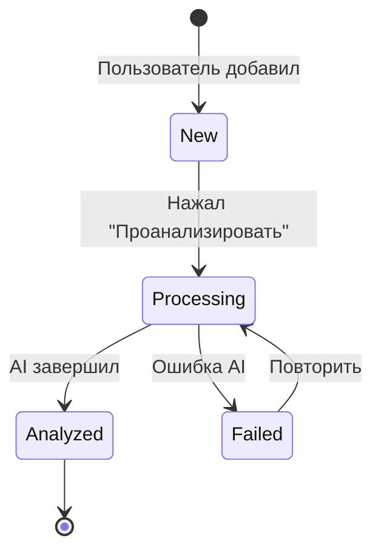

# Журнал — Архитектура и UX

## Обзор

**Журнал** (`/traces`) — единая точка входа для всех записей пользователя. Объединяет:
- Ситуации (entries) — описания реальных событий для анализа
- Рефлексии (evidences) — записи о применении способностей

## Навигация

```
Обзор → Эксперименты → Журнал → Архитектура
```

Старые страницы `/entries` и `/evidence` редиректят на `/traces`.

## Типы записей

| Тип | Источник | Иконка | Описание |
|-----|----------|--------|----------|
| Ситуация | Entry | 📝 | Описание события для ИИ-анализа |
| Рефлексия (квест) | Evidence + quest_id | 💭 | Запись о применении в рамках квеста |
| Рефлексия (свободная) | Evidence без связей | 💭 | Свободная заметка |

## Фильтры

- **Все** — все записи
- **Ситуации** — только Entry (type = 'entry')
- **Из квестов** — Evidence с quest_id
- **Свободные** — Evidence без quest_id и session_id

## Карточка записи (JournalEntryCard)

### Компактный вид

```
┌─────────────────────────────────────────┐
│ 💭 Рефлексия                    2ч назад│
│ "На встрече с командой заметил..."      │
│                                         │
│ 🎯 Квест: Делегирование  🌳 Узел        │
└─────────────────────────────────────────┘
```

### Раскрытый вид

```
┌─────────────────────────────────────────────────────────────────┐
│ 💭 Рефлексия                                   ✕ закрыть       │
│ 2 января 2024, 14:30                                           │
├─────────────────────────────────────────────────────────────────┤
│                                                                 │
│ ┌─────────────────────────────────────────────────────────────┐ │
│ │ "На встрече с командой я предложил новый подход к         │ │
│ │  делегированию задач. Заметил сопротивление, но..."       │ │
│ └─────────────────────────────────────────────────────────────┘ │
│                                                                 │
│ ── Откуда запись ──────────────────────────                     │
│ 🎯 Квест: Практика делегирования                               │
│    Статус: В работе                                            │
│                                                                 │
│ ── Что дало ───────────────────────────────                     │
│ 🌳 Делегирование — связано с этой способностью                 │
│                                                                 │
└─────────────────────────────────────────────────────────────────┘
```

## Lifecycle ситуации



| Статус | Условие | Визуал |
|--------|---------|--------|
| Новая | Entry без Session | ⏳ Ожидает анализа + кнопка |
| Анализируется | Session.status = processing | 🔄 Loader |
| Проанализирована | Session.status = succeeded | ✅ + инсайты + квесты |
| Ошибка | Session.status = failed | ❌ + кнопка "Повторить" |

## Модалки

### AddSituationModal
- Добавление новой ситуации
- Открывается по кнопке "+ Добавить" в журнале

### AddEvidenceModal  
- Добавление рефлексии
- Открывается на dashboard при клике "+ Рефлексия"
- Связывается с текущим квестом

## Файловая структура

```
apps/web/src/
├── app/
│   ├── traces/
│   │   └── page.tsx          # Журнал (главная страница)
│   ├── entries/
│   │   ├── page.tsx          # Редирект на /traces
│   │   ├── new/page.tsx      # Редирект на /traces
│   │   └── [id]/page.tsx     # Детальный просмотр ситуации
│   └── evidence/
│       ├── page.tsx          # Редирект на /traces
│       └── new/page.tsx      # Редирект на /traces
├── components/
│   ├── JournalEntryCard.tsx  # Карточка записи
│   └── modals/
│       ├── AddSituationModal.tsx
│       └── AddEvidenceModal.tsx
└── lib/
    └── api.ts                # getEntries, getEvidence, createEntry, createEvidence
```

## API

### Чтение
- `GET /entries` — список ситуаций
- `GET /evidence` — список рефлексий
- `GET /sessions` — результаты анализа

### Создание
- `POST /entries` — создать ситуацию
- `POST /evidence` — создать рефлексию
- `POST /sync/analyze/{entryId}` — запустить анализ

## Терминология

| Было | Стало |
|------|-------|
| Доказательство | Рефлексия |
| След | Запись в журнале |
| Ситуация (отдельно) | Ситуация (в журнале) |

## Связи с другими модулями

- **Квесты** — рефлексия привязывается к квесту через `quest_id`
- **Дерево** — рефлексия привязывается к узлу через `ability_node_id`
- **Сессии** — ситуация анализируется и создаётся Session
- **Dashboard** — показывает последнюю ситуацию или квест в фокусе
