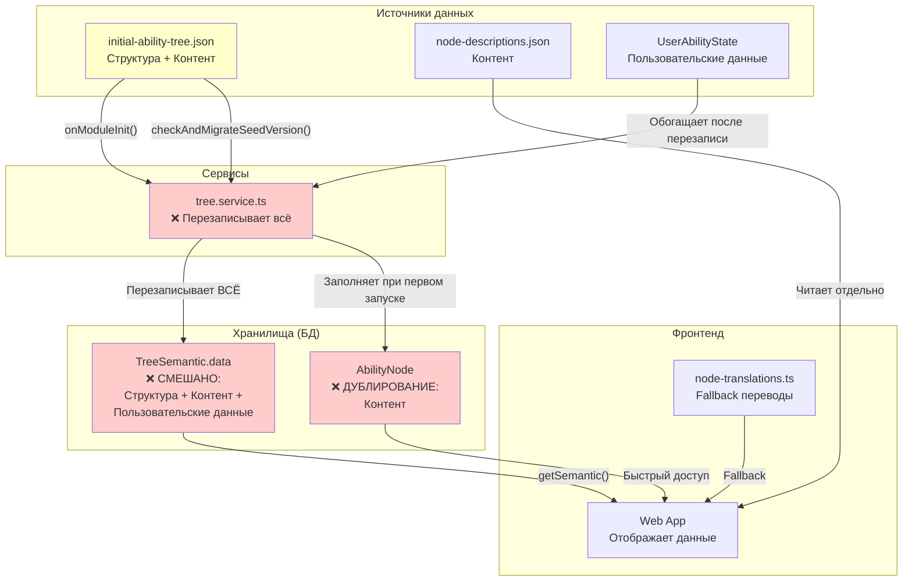
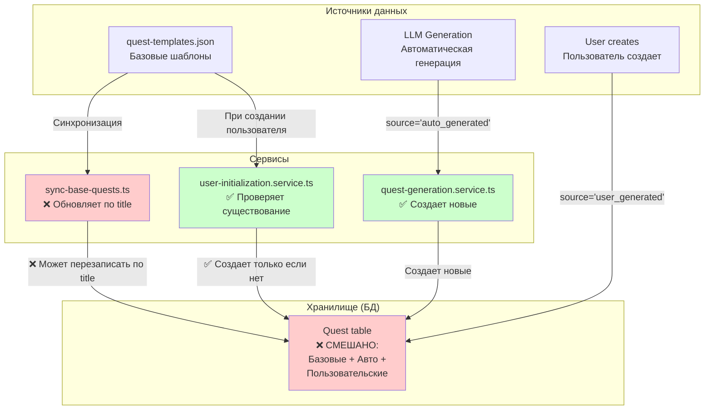
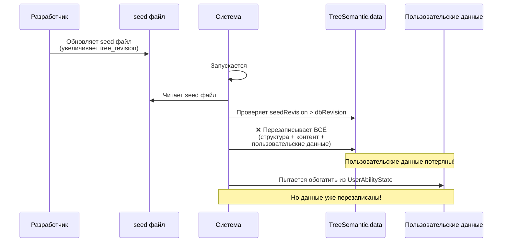
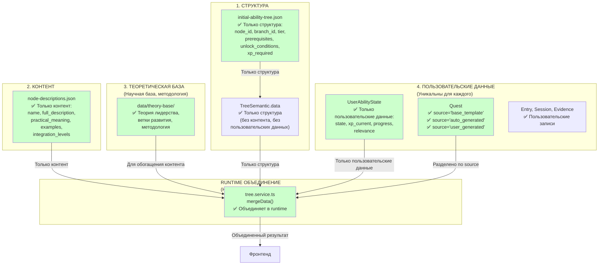
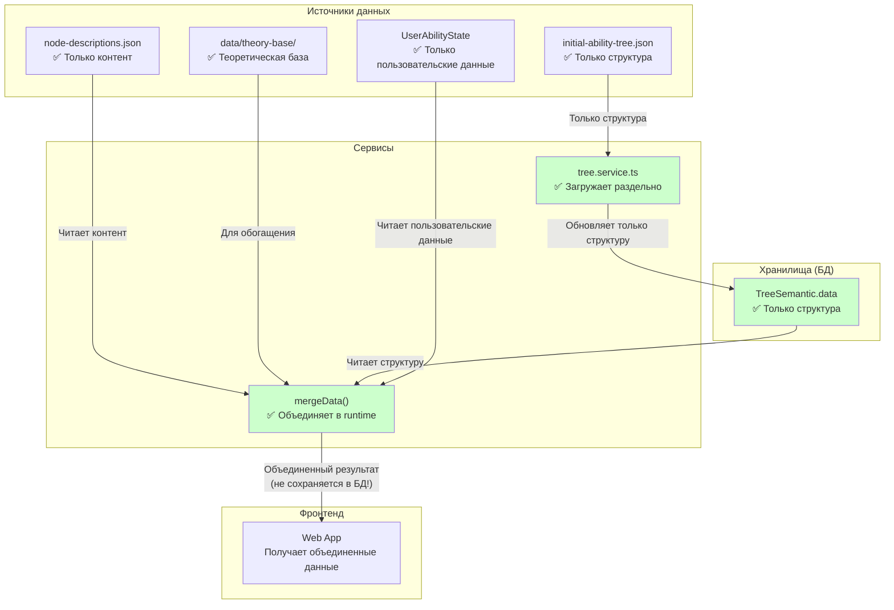
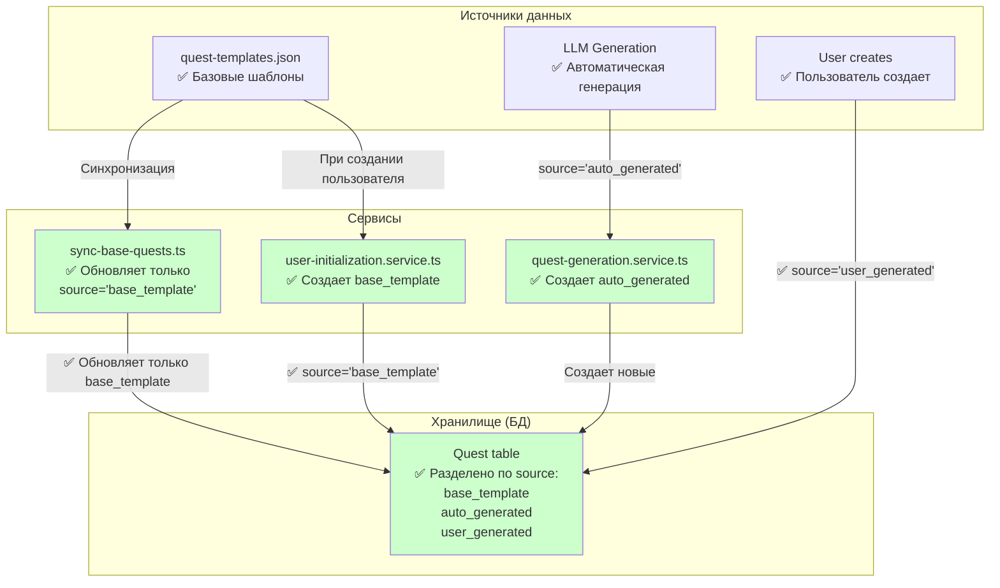
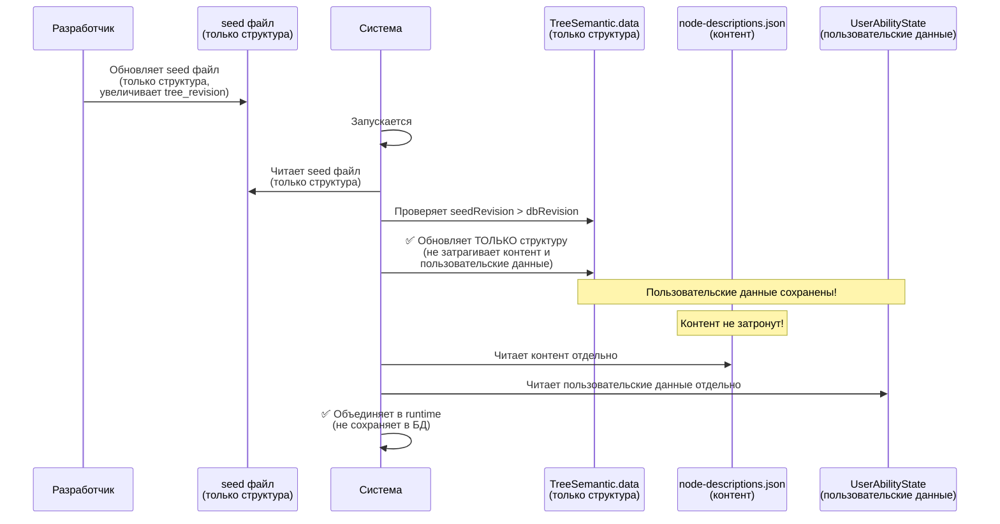
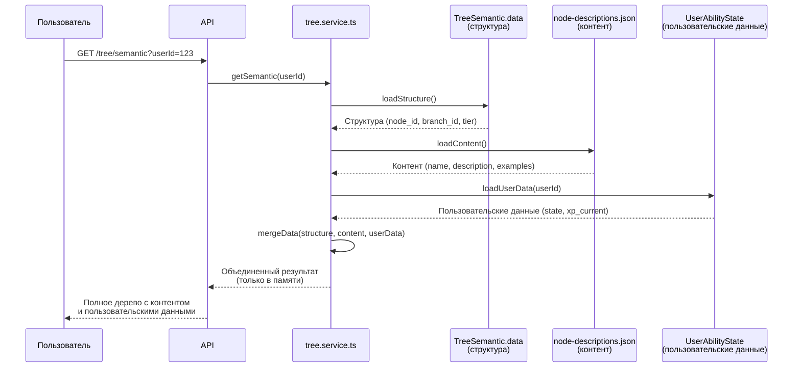

# Визуализация архитектуры: Текущая vs Правильная

**Дата создания:** 2025-01-27  
**Статус:** Этап 1 - Аудит и документация

---

## 1. Текущая архитектура (с проблемами)

### 1.1. Диаграмма потоков данных - Nodes

**Проблемы:**
1. ❌ `TreeSemantic.data` смешивает структуру, контент и пользовательские данные
2. ❌ При обновлении seed файла перезаписывается всё, включая пользовательские данные
3. ❌ Контент дублируется в `TreeSemantic.data`, `AbilityNode` и `node-descriptions.json`
4. ❌ Нет единого источника истины для контента

### 1.2. Диаграмма потоков данных - Quests

**Проблемы:**
1. ❌ `sync-base-quests.ts` обновляет квесты по `title`, может перезаписать пользовательские квесты
2. ❌ Нет четкого разделения между базовыми и пользовательскими квестами (хотя поле `source` есть)

### 1.3. Процесс обновления seed файла (текущий)

---

## 2. Правильная архитектура (целевая)

### 2.1. Принцип разделения ответственности

### 2.2. Диаграмма потоков данных - Nodes (правильная)

### 2.3. Диаграмма потоков данных - Quests (правильная)

### 2.4. Процесс обновления seed файла (правильный)

### 2.5. Процесс запроса дерева (правильный)

---

## 3. Сравнение архитектур

### 3.1. Таблица сравнения

| Аспект | Текущая архитектура | Правильная архитектура |
|--------|---------------------|----------------------|
| **Структура** | Смешана с контентом в `TreeSemantic.data` | Отдельно в `TreeSemantic.data` (только структура) |
| **Контент** | Дублируется в 3 местах: `TreeSemantic.data`, `AbilityNode`, `node-descriptions.json` | Единый источник: `node-descriptions.json` |
| **Пользовательские данные** | Смешаны с контентом в `TreeSemantic.data` | Отдельно в `UserAbilityState` |
| **Обновление seed** | Перезаписывает всё (структура + контент + пользовательские данные) | Обновляет только структуру |
| **Объединение данных** | Хранится в БД (смешано) | Происходит в runtime (не сохраняется) |
| **Защита от перезаписи** | Нет | Есть (разделение по source для квестов) |
| **Единый источник истины** | Нет (данные дублируются) | Да (для каждого типа данных свой источник) |

### 3.2. Преимущества правильной архитектуры

1. **Безопасные обновления:**
   - Обновление seed файла не затрагивает пользовательские данные
   - Обновление контента не затрагивает структуру
   - Обновление пользовательских данных не затрагивает ничего другого

2. **Нет дублирования:**
   - Контент хранится в одном месте (`node-descriptions.json`)
   - Пользовательские данные хранятся в одном месте (`UserAbilityState`)
   - Структура хранится в одном месте (`TreeSemantic.data`)

3. **Производительность:**
   - Контент кэшируется в памяти (не в БД)
   - Пользовательские данные загружаются только при необходимости
   - Структура обновляется редко

4. **Масштабируемость:**
   - Легко добавлять новые типы контента
   - Легко обновлять контент независимо от структуры
   - Легко добавлять новые пользовательские данные

---

## 4. Миграция: Текущая → Правильная

### 4.1. Этапы миграции

```mermaid
graph LR
    A["Текущая<br/>Смешано всё"] -->|"Этап 1: Аудит"| B["Документация<br/>Проблемы выявлены"]
    B -->|"Этап 2: Валидация"| C["Валидация контента<br/>Теоретическая база"]
    C -->|"Этап 3: Миграция Nodes"| D["Разделение структуры<br/>и контента"]
    D -->|"Этап 4: Миграция Quests"| E["Разделение базовых<br/>и пользовательских"]
    E -->|"Этап 5: Экспорт"| F["Экспорт пользовательских<br/>данных"]
    F -->|"Этап 6: Защита"| G["Правильная<br/>Разделено всё"]
    
    style A fill:#ffcccc
    style G fill:#ccffcc
```

### 4.2. Критические точки миграции

1. **Извлечение структуры из TreeSemantic.data:**
   - Удалить `name`, `description` (контент)
   - Удалить `state`, `xp_current` (пользовательские данные)
   - Оставить только структуру

2. **Обновление логики загрузки:**
   - Загружать структуру из `TreeSemantic.data`
   - Загружать контент из `node-descriptions.json`
   - Загружать пользовательские данные из `UserAbilityState`
   - Объединять в runtime

3. **Защита от перезаписи:**
   - Обновлять только квесты с `source='base_template'`
   - Не перезаписывать пользовательские квесты

---

**См. также:**
- [FULL_ARCHITECTURE_AUDIT.md](./FULL_ARCHITECTURE_AUDIT.md) - Полный аудит
- [ARCHITECTURE_RULES.md](./ARCHITECTURE_RULES.md) - Правила архитектуры
