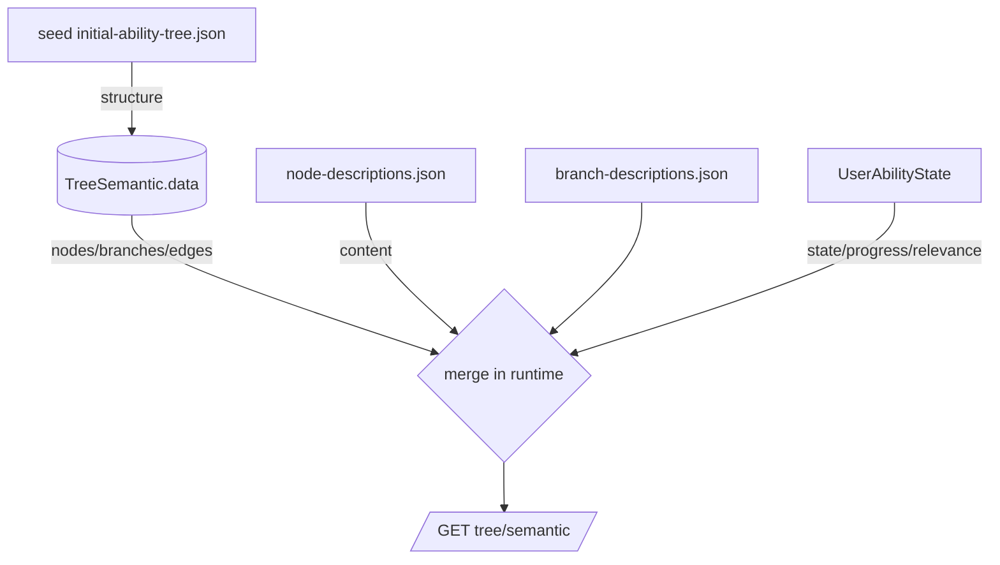

# 📡 Аудит архитектуры данных, синхронизации и гейм-логики (ветки/узлы/квесты/кейсы/XP)

**Область:** Backend (NestJS), данные/контент/пользовательские состояния, AI-анализ ситуаций  
**Фокус:** SSOT, потоки синхронизации, условия открытия, XP/прогресс, квесты/кейсы, хранение пользовательских данных, промпты и артефакты LLM  
**Дата:** 2026-01-14

---

## 1) Карта источников истины и потоков

- **Структура дерева** → `packages/shared/src/seed/initial-ability-tree.json` (nodes/branches/edges, prerequisites, xp_required, tree_revision).  
- **Контент** → `data/node-descriptions.json`, `branch-descriptions.json`, `quest-templates.json`, `interactive-cases.json`, `quest-theories-mapping.json`, `builds.json`.  
- **Пользовательские данные** → БД (Prisma): `UserAbilityState` (state/progress/relevance/internal_progress/stored_experience), `Quest`, `CaseProgress`, `Entry`, `Session`, `SessionArtifact`, `ChangeLog`.  
- **Runtime объединение** (идеально): структура (seed/TreeSemantic) + контент (JSON) + пользовательские данные (БД) → без сохранения обратно в `TreeSemantic`.  
- **Фронты синхронизации**: auto-sync seed → `TreeSemantic` (может быть отключен `DISABLE_TREE_AUTO_SYNC`), кэш контента в `TreeService`, кэш кейсов в `CasesService`.

### Поток дерева/контента/пользовательских данных

---

## 2) Дерево способностей, XP и статусы

**Наблюдения**
- `TreeService.getSemantic` загружает `TreeSemantic.data`, обогащает контентом и затем `enrichWithUserState` (если есть userId). Если `TreeSemantic.data` содержит user-поля (xp_current/state), они проходят дальше до мерджа → риск загрязнения структуры.  
  - `normalizeSeedData` преобразует `unlock_conditions.required_nodes` → `prerequisites`, но **не чистит** пользовательские поля, если они уже лежат в `TreeSemantic`.  
- `AbilityStateService.loadCurrentStates` берёт состояние из `treeService.getSemantic(userId)` → прогресс считается как `node.xp_current / xp_required` из дерева, а не из `UserAbilityState`. Роль `UserAbilityState` сведена к relevance/last_activity_date. Это ломает SSOT и позволяет перезаписи пользовательских данных через seed/TreeSemantic.  
- `AbilityEngine` корректно работает с internalProgress/storedExperience, но данные до него не приходят из БД (progress вычисляется из `xp_current` дерева).  
- Auto-sync: при `seedRevision > dbRevision` и `DISABLE_TREE_AUTO_SYNC` отключено, `TreeService` upsert’ит `TreeSemantic.data = normalizedSeedData`. Если seed содержит ошибки или случайно user-поля, они запишутся в БД.  
- `TreeLayout` держит layout JSON без валидации соответствия `tree_revision`. Возможна рассинхронизация между структурой и layout.

**Риски**
- Потеря/перезапись пользовательского прогресса при обновлении seed или TreeSemantic, т.к. XP и state читаются из TreeSemantic, а не из `UserAbilityState`.  
- Нарушение SSOT: контент/пользовательские поля могут оказаться в `TreeSemantic.data` и стать «структурой».  
- Возможные расхождения `tree_revision` ↔ `TreeLayout.computed_from_tree_revision` не проверяются на чтении.

**Рекомендации**
- Жёстко чистить `TreeSemantic.data` при чтении/записи: хранить только структуру (node_id/branch_id/tier/prerequisites/xp_required/unlock_conditions/edges/branches). Перед мерджем удалять state/xp_current/name/description.  
- В `AbilityStateService.loadCurrentStates` читать state/progress/internal_progress/stored_experience из `UserAbilityState` (true SSOT), а `xp_required` — из структуры seed.  
- При auto-sync писать в `TreeSemantic` строго «structureOnly», вычисленного из seed (без контента и user-полей); при отключённом авто-синке логировать требуемую ручную команду миграции.  
- Ввести валидацию соответствия `TreeLayout.computed_from_tree_revision === TreeSemantic.tree_revision` и auto-rebuild при расхождении.  
- Зафиксировать неизменяемые поля (например, через Zod schema) перед сохранением `TreeSemantic.data`.

---

## 3) Квесты и кейсы

**Наблюдения**
- Базовые квесты: `data/quest-templates.json`, генерация через `QuestGenerationService` + детерминированный `QuestEngine` (типы micro/weekly/story, XP = base + reflection). Теория подтягивается через LLM (`generateQuestTheory`).  
- Автогенерация квестов при анализе сессии: `AnalysisParserService` → `QuestOrchestrationService.handleSessionAnalyzed` → `QuestGenerationService.generateQuests` → `QuestRepository.createMany`. Лимит активных квестов управляется `manageActiveQuestLimit` (до 5).  
- Кейсы: `CasesService` грузит `data/interactive-cases.json` в память, отдаёт фильтры по node/branch, прогресс по пользователю строит из `CaseProgress` (БД). Связка с узлами идёт через `node_id/branch_id` в кейсе, но влияние на XP делегировано `AbilityStateService` (зависит от узлового XP pipeline).

**Риски**
- Нет валидации связки `linked_nodes` квестов с актуальной структурой дерева (может ссылаться на удалённые/переименованные node_id).  
- Теория квеста зависит от LLM, но `SessionArtifact`/`ChangeLog` не версионируют применённый промпт/модель при сохранении квеста.  
- Кейсы кэшируются в памяти без инвалидации при изменении файла (только через ручной `clearCache`).  
- Критерии квестов (`criteria_json`) не нормализуются под XP-трудоёмкость узла (нет связи difficulty ↔ node level).

**Рекомендации**
- При загрузке seed/TreeSemantic собирать список валидных node_id и валидировать `linked_nodes` квестов/кейсов; падать в логи/метрику при рассинхроне.  
- Сохранять в `SessionArtifact`/`Quest` ссылку на prompt_id/version и model, полученные при генерации теории, чтобы трассировать артефакты.  
- Добавить файловый watcher или endpoint для сброса кейс-кэша в dev/prod.  
- В `QuestEngine.calculateReward` учитывать tier узла и сложность кейса/квеста (уже есть аргументы, но не связаны с реальными данными).

---

## 4) Хранение и актуализация пользовательских данных

**Наблюдения**
- БД модели (Prisma): `User`, `UserAbilityState` (composite PK user_id+node_id, relevance/internal_progress/stored_experience/last_activity_date), `Quest`, `CaseProgress`, `Entry`, `Session`, `SessionArtifact`, `ChangeLog`, `ConfigSet/ConfigVersion`, `TreeSemantic/TreeLayout`.  
- `AbilityStateService.applySignals` применяет `AbilityEngine` к состояниям, но состояние берётся из дерева, а не из `UserAbilityState`. Запись идёт в `UserAbilityState` через upsert (в методе ниже по файлу).  
- `ChangeLog` хранит before/after и inverse_ops для undo, но не участвует в синхронизации дерева (нет реплея на TreeSemantic).  
- Кэш контента узлов/веток живёт в памяти процесса, нет TTL.

**Риски**
- Поверхностная загрузка пользовательского прогресса → возможна запись «грязного» состояния из дерева обратно в `UserAbilityState` (особенно после seed auto-sync).  
- Нет единообразной миграции при изменении `tree_revision`: пользовательские состояния не проверяются на существование новых/удалённых узлов.

**Рекомендации**
- В `AbilityStateService` загрузку базового состояния брать из `UserAbilityState`; если отсутствует запись — инициировать default (locked, progress=0) на лету без чтения xp_current из дерева.  
- Ввести миграцию при смене `tree_revision`: добавить/удалить записи `UserAbilityState` по diff seed ↔ user state; фиксировать в `ChangeLog`.  
- Добавить TTL/refresh hook для кэша контента и healthcheck на валидность JSON (node/branch descriptions).

---

## 5) Цепочка ИИ-анализа ситуаций и промпты

**Наблюдения**
- Анализ: `Entry` → `AnalysisParserService.analyzeEntry` → LLM (`LLMService.analyzeSituation`) с жёстко заданным prompt (inline в `buildAnalysisPrompt`). Ответ парсится/валидируется и пишется в `Session`, `SessionArtifact` не создаётся автоматически для итогового JSON.  
- Квесты генерируются асинхронно после анализа через `QuestOrchestrationService`.  
- Промпты версионируются в таблице `promptRegistry` (admin/prompts), но `analyzeSituation` не читает оттуда, использует встроенный шаблон.  
- LLM вызовы логируются через `logStructuredCall`, хранятся `LlmRun` записи (модель в Prisma).

**Риски**
- Отсутствие централизованного prompt management для анализа ситуаций → изменение промпта потребует релиза кода, версии не фиксируются в `Session`/`LlmRun` как ссылочные идентификаторы.  
- Нет артефакта (`SessionArtifact`) с полной копией ответа модели; при изменении промпта/парсера невозможно воспроизвести прошлый результат.  
- Fallback на mock при отсутствии API-ключей может тихо пройти в прод-среде (провайдер определяется по env без жёсткой проверки окружения).

**Рекомендации**
- Вынести analysis prompt в `promptRegistry` и ссылаться по `prompt_id/version` при вызове; сохранять это в `Session` и `LlmRun`.  
- Создавать `SessionArtifact` для сырых и нормализованных данных (summary, insights, ability_signals, focus) с указанием модели/версии промпта.  
- Добавить guard: в prod запрещать `provider === 'none'` и mock-ответы.  
- Для квест-теории (`generateQuestTheory`) также ссылаться на активный prompt и сохранять артефакт.

---

## 6) Группировка рисков и действия

- **SSOT-срыв (критично):** XP/state берутся из `TreeSemantic`, не из `UserAbilityState`; auto-sync может перетереть прогресс. → Исправить загрузку состояний, чистить структуру, мигрировать существующие записи.  
- **Валидность связей:** `linked_nodes` квестов/кейсов не валидируются на актуальное дерево. → Ввести валидацию и репорты.  
- **Prompt governance:** анализ ситуаций и теория квестов используют inline промпты. → Перенести в `promptRegistry`, логировать prompt_id/version в артефакты.  
- **Layout drift:** `TreeLayout` не проверяет ревизию. → Добавить проверку и rebuild.  
- **Кэширование контента:** node/branch descriptions и кейсы кэшируются без TTL/refresh. → Добавить refresh endpoint/TTL.

---

## 7) Быстрые next steps (приоритезировано)

1) Исправить `AbilityStateService.loadCurrentStates`: источник прогресса → `UserAbilityState`; structure-only из seed/TreeSemantic; удалить зависимость от xp_current/state в TreeSemantic.  
2) Очистить `TreeSemantic.data` (скрипт): выкинуть контент и user-поля, нормализовать prerequisites/xp_required; пересобрать layout или пометить rebuild.  
3) Валидатор связей: пройтись по `Quest.linked_nodes`, `interactive-cases.node_id/branch_id`, `TreeLayout` против текущего seed; завести отчёт/метрики.  
4) Prompt registry: вынести `buildAnalysisPrompt` и `generateQuestTheory` в `promptRegistry`, писать `prompt_id/version` в `SessionArtifact`/`LlmRun`/`Quest`.  
5) Артефакты анализа: сохранять сырой ответ LLM в `SessionArtifact` + ссылку на модель/промпт; fail-safe при provider=none в прод.  
6) Инвалидация кэшей: добавить TTL/endpoint для node/branch/cases; healthcheck на JSON корректность.

---
