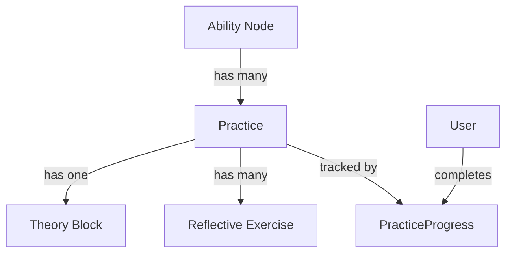

# План: Система "Практик" для не-применимых узлов

**Дата создания:** 13.01.2026  
**Статус:** Готов к реализации (после деплоя кейсов)

---

## Контекст

Для 12 узлов (психология, концепции, метрики) интерактивные кейсы не подходят:
- **Психологические**: `node_grounding_point`, `node_self_regulation`, `node_weak_zone_diagnosis`, `node_recovery_skills`, `node_emotional_work`, `node_cognitive_maturity`, `node_role_energy`
- **Концепции/Метрики**: `node_psychological_ownership`, `node_collective_efficacy`, `node_vertical_development`, `node_ddo`
- **Master**: `node_thinking_through_form`

Нужен отдельный формат развития — **теория + рефлексия + практики**.

---

## Архитектура решения

### 1. Новая сущность: Practice



**Ключевые отличия от Quest/Case:**
- Не требует внешнего действия (story/micro quest)
- Не моделирует ситуацию выбора (case)
- Фокус на внутренней работе: рефлексия, концепты, самонаблюдение

---

## Структура данных

### Practice Schema (JSON + Prisma)

```typescript
// packages/shared/src/schemas/practice.schema.ts
export interface Practice {
  id: string;                    // practice_grounding_point_1
  node_id: string;               // node_grounding_point
  branch_id: string;
  level: 'basic' | 'intermediate' | 'advanced';
  
  // Контент
  title: string;
  subtitle?: string;
  description: string;           // Зачем эта практика
  
  // Теория
  theory: {
    sources: Array<{             // Книги/статьи
      title: string;
      author: string;
      excerpt: string;           // Цитата/выжимка
      page?: string;
    }>;
    key_concepts: string[];      // Основные понятия
    explanation: string;         // Объяснение концепции
  };
  
  // Рефлексивные упражнения
  exercises: Array<{
    id: string;
    type: 'reflection' | 'observation' | 'practice';
    title: string;
    instruction: string;
    prompts: string[];           // Направляющие вопросы
    duration?: string;           // "10 мин ежедневно"
    frequency?: string;          // "3 раза в неделю"
  }>;
  
  // Критерии прохождения
  completion_criteria: {
    type: 'diary_entries' | 'duration' | 'reflection_depth';
    target: number;
    description: string;
  };
  
  // Награда
  reward: {
    xp: number;
    insight?: string;            // Инсайт при завершении
  };
}
```

### Prisma модель

```prisma
// apps/api/prisma/schema.prisma
model Practice {
  id          String   @id @default(uuid())
  practice_id String   @unique          // practice_grounding_point_1
  node_id     String
  branch_id   String
  level       String                    // basic/intermediate/advanced
  content     Json                      // Полная структура Practice
  created_at  DateTime @default(now())
  updated_at  DateTime @updatedAt
  
  progress    PracticeProgress[]
  @@index([node_id])
  @@index([branch_id])
}

model PracticeProgress {
  id           String   @id @default(uuid())
  user_id      String
  practice_id  String
  
  // Прогресс
  started_at   DateTime @default(now())
  completed_at DateTime?
  entries      Json[]                   // Записи из дневника/рефлексии
  
  // XP
  xp_earned    Int      @default(0)
  
  practice     Practice @relation(fields: [practice_id], references: [id])
  
  @@unique([user_id, practice_id])
  @@index([user_id])
  @@index([practice_id])
}
```

---

## Контент для 12 узлов

### Категории практик

**1. Психологические процессы** (7 узлов)
- **Формат:** Теория + ежедневные наблюдения + рефлексивный дневник
- **Пример** (`node_grounding_point`):
  - Теория: цитаты из книг про anchoring, self-awareness
  - Упражнения: "Найди 3 момента сегодня, когда ты был устойчив", "Опиши свою точку опоры"
  - Критерий: 7 записей в дневнике за 2 недели

**2. Концепции/Метрики** (4 узла)
- **Формат:** Теория + анализ команды + чек-листы наблюдения
- **Пример** (`node_collective_efficacy`):
  - Теория: Albert Bandura, исследования групповой эффективности
  - Упражнения: "Оцени уверенность команды по 10 параметрам", "Наблюдай 5 ситуаций"
  - Критерий: Заполнить 2 чек-листа наблюдений

**3. Master-концепты** (1 узел)
- **Формат:** Глубокая теория + case studies + эссе-рефлексия
- **Пример** (`node_thinking_through_form`):
  - Теория: философия формы, примеры из архитектуры/дизайна
  - Упражнения: "Опиши 3 формы в своей организации", эссе 500+ слов
  - Критерий: Развернутая рефлексия, проверка экспертом

---

## API Endpoints

```
GET    /api/practices                    # Все практики
GET    /api/practices/:id                # Конкретная практика
GET    /api/practices/node/:nodeId       # Практики для узла
POST   /api/practices/:id/start          # Начать практику
POST   /api/practices/:id/entry          # Добавить запись в дневник
POST   /api/practices/:id/complete       # Завершить практику
GET    /api/user/practices/progress      # Прогресс пользователя
```

---

## UI Компоненты

### PracticeCard (список)
- Теория-иконка (книга)
- Длительность ("2 недели, 10 мин/день")
- Тип: Рефлексия / Наблюдение / Практика
- Прогресс: "3/7 записей"

### PracticeDetailCard (детальный просмотр)
**Секции:**
1. **Теория** — источники, концепты, объяснение
2. **Упражнения** — список с инструкциями и промптами
3. **Дневник** — форма для записей (textarea)
4. **Прогресс** — визуализация критериев

### Компонент "Дневник рефлексии"
```typescript
interface ReflectionEntry {
  date: Date;
  prompts: string[];           // Использованные вопросы
  text: string;                // Ответ пользователя (markdown)
  mood?: string;               // Опционально
}
```

---

## Интеграция с системой XP

**XP за практики:**
- **Basic**: 40 base XP + 160 reflection XP (если ≥300 символов) = 200 XP
- **Intermediate**: 60 + 240 = 300 XP
- **Advanced**: 80 + 320 = 400 XP

**Логика рефлексии:**
- Проверка длины текста (≥300 символов)
- Проверка завершения всех упражнений
- Проверка регулярности (для streak-практик)

---

## Файловая структура

```
data/
  practices.json              # Все практики (как cases)

apps/api/src/
  practices/
    practices.module.ts
    practices.controller.ts
    practices.service.ts
    dto/
      create-practice-entry.dto.ts
      
apps/web/src/
  components/
    cards/
      PracticeCard.tsx
      PracticeDetailCard.tsx
    reflection/
      ReflectionDiary.tsx
      ReflectionPrompts.tsx
      
  app/
    practices/
      page.tsx                # Список практик
      [id]/
        page.tsx              # Детальный просмотр
```

---

## Этапы реализации

### Phase 1: Минимум (1-2 практики для проверки концепции)
1. Создать схемы данных (Prisma + TypeScript)
2. Создать 2 примера практик (`node_grounding_point`, `node_self_regulation`)
3. Базовый API (CRUD + progress tracking)
4. Простой UI (карточка + дневник)

### Phase 2: Полный набор
1. Создать практики для всех 12 узлов
2. Интеграция с XP системой
3. Красивый UI с визуализацией прогресса
4. Аналитика (streak, depth of reflection)

### Phase 3: Продвинутые фичи
1. Экспертная проверка эссе (для master-практик)
2. Sharing рефлексий с коучем/ментором
3. AI-ассистент для направления рефлексии

---

## Примеры практик

### node_grounding_point (Базовый)

```json
{
  "id": "practice_grounding_point_1",
  "title": "Поиск точки опоры",
  "description": "Исследование своих внутренних ресурсов устойчивости",
  "theory": {
    "sources": [{
      "title": "Дао лидерства",
      "author": "Джон Хейдер",
      "excerpt": "Лидер знает, откуда берётся его сила. Он не зависит от внешних обстоятельств..."
    }],
    "key_concepts": ["anchoring", "self-awareness", "resilience"],
    "explanation": "Точка опоры — это внутренний ресурс, который позволяет сохранять устойчивость в хаосе..."
  },
  "exercises": [{
    "type": "observation",
    "title": "Дневник устойчивости",
    "instruction": "Каждый вечер фиксируй момент, когда ты был устойчив",
    "prompts": [
      "Что происходило вокруг?",
      "Что ты чувствовал?",
      "Откуда брал силы?"
    ],
    "duration": "5 минут",
    "frequency": "ежедневно, 7 дней"
  }],
  "completion_criteria": {
    "type": "diary_entries",
    "target": 7,
    "description": "7 записей за 2 недели (минимум 200 символов)"
  }
}
```

---

## Преимущества решения

✅ **Отдельная сущность** — не перегружаем квесты/кейсы  
✅ **Подходит для психологии** — рефлексия вместо внешнего действия  
✅ **Измеримый прогресс** — дневниковые записи, регулярность  
✅ **Теория из книг** — авторитетные источники  
✅ **Гибкость** — разные форматы для разных категорий узлов  
✅ **XP система** — интегрируется с общим прогрессом

---

## Открытые вопросы

1. **Проверка качества рефлексий** — автоматическая (по длине) или ручная (эксперт)?
2. **Приватность** — дневники полностью приватны или можно шарить с коучем?
3. **AI помощь** — нужен ли AI-ассистент для углубления рефлексии?

---

## TODO

- [ ] Спроектировать Prisma схему и TypeScript типы для Practice и PracticeProgress
- [ ] Создать 2 примера практик (grounding_point, self_regulation) в JSON
- [ ] Реализовать базовый API: CRUD practices + progress tracking
- [ ] Создать UI компоненты: PracticeCard, PracticeDetailCard, ReflectionDiary
- [ ] Интегрировать с XP системой (base + reflection bonuses)
